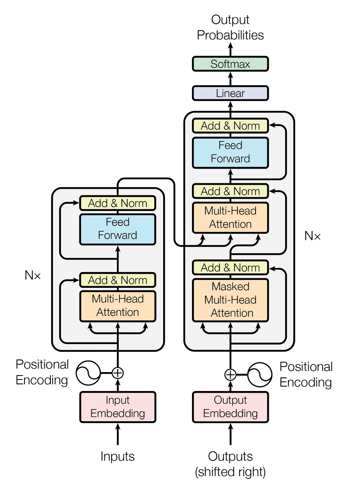
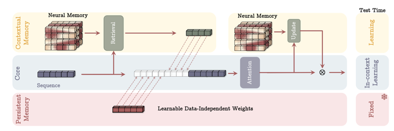
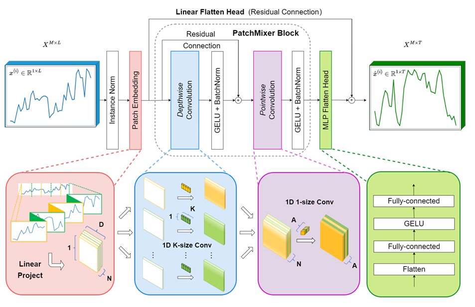
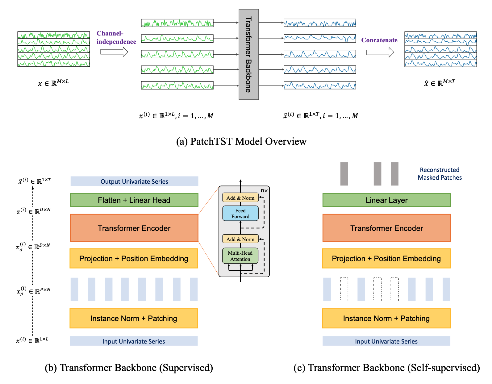
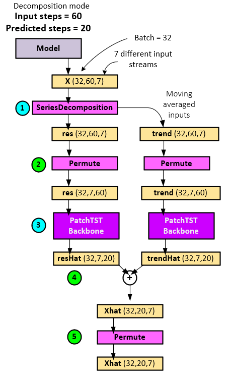

# [Transformer]

# [TITAN]

## MAC(Memory as Context)
Titan의 핵심은 '과거로부터 요약된 문맥 메모리'를 현재 입력과 함께 쓰는 것. 컨텍스트 메모리를 동적으로 업데이트하면, 
분포 이동(프로모션/단종/계절성 변화)에 즉각 반응할 수 있다.

## LMM(Local Memory Matching)
'놀라운(surprising) 변화'를 메모리와의 유사도 기준으로 보강하는 모듈. MAC이 '문맥을 불러오기'라면 LMM은
'그 중 꼭 필요한 부분을 고르는' 역할.

## Test-Time Adaption(TTA/TTM)
학습이 끝난 뒤, 테스트 시점에서 아주 소량의 gradient step으로 최신 관측에 맞춰 모델을 재보정한다.
시계열처럼 시간에 따라 분포가 변하는 문제에 효과적이지만, 데이터 누수 방지와 안정성이 중요.

# [PatchMixer]

긴 시계열을 효율적으로 예측하기 위해, 시계열을 일정 길이의 
“패치(patch)”로 쪼개고 패치 간·채널 간 정보를 가볍게 섞어 학습하는 모델.
목적: 긴 시계열을 효율적으로 예측하기 위해, 시계열을 일정 길이의 “패치(patch)”로 쪼개고 패치 간·채널 간 정보를 가볍게 섞어 학습하는 모델입니다.

### 핵심 아이디어:

입력을 patch_len 기준으로 슬라이딩/비중첩 패치로 분할 →
패치 믹싱(패치 축에서의 상호작용) →
채널 믹싱(변수/피처 축에서의 상호작용) →

예측 헤드로 다중 지평선(horizon) 출력을 생성.
Mixer 계열(MLP-Mixer) 아이디어를 시계열 패치에 적용한 형태라 보시면 됨.

### 구조: 
RevIN(선택) → 패치화 → [패치 믹서 블록(패치 축 MLP/경량 Conv) ↔ 채널 믹서 블록(채널 축 MLP)] × L → 예측 헤드(포인트/퀀타일).

### 장점
경량·고속: 어텐션 없이 전역 상호작용을 근사해 파라미터와 연산량이 작고, 배치 병렬화가 잘 됨.
길이 확장에 유리: 패치 단위 처리로 긴 시퀀스에서도 메모리 사용이 안정적.
유연한 출력: 다중 지평선, 다중 변수를 손쉽게 다루고 퀀타일 예측(불확실성)도 자연스럽게 지원.

### 한계/주의
완전한 전역 의존성(멀리 떨어진 시점 간 정교한 상호작용) 표현은 Transformer 대비 제한될 수 있어, 계절성/트렌드 보강(포지셔널 임베딩, 캘린더 피처, 트렌드 보정 등)과 함께 쓰면 효과적.
적용 예: 수요예측, 센서·IoT 시계열, 금융 체인, 에너지 부하 등 멀티변량·장기 예측에 경량 대안으로 적합.

### 비교 요약
PatchTST(Transformer) 대비 가볍고 빠름, 긴 시퀀스에서 메모리 안정적.
CNN/TCN 대비 패치·채널 분해를 통해 전역 정보 집약을 더 직접적으로 수행.

# [PatchTST]
### Ref: [https://www.signalpop.com/2023/11/06/understanding-the-patchtst-model-for-time-series-prediction/]
긴 시계열을 패치 단위로 분할해 Transformer의 자기어텐션으로 전역 의존성을 학습, 장기 예측 성능과 안정성을 동시에 확보.
## [Original]

## [Decomposition Mode]

### 핵심 아이디어
입력 시계열을 patch_len 기준으로 패치화(비중첩/슬라이딩 가능) →
각 패치를 임베딩 후 Transformer 인코더로 시점 간 전역 상호작용 학습 →
패치 표현을 집약(클래스 토큰/평균 풀링 등)하여 헤드에서 다중 지평선 예측.
Patch(국소 구간)로 분해해 길이를 줄이고, 어텐션으로 전역 패턴을 잡는 설계.

### 구조
(옵션) RevIN → 패치화/포지셔널 인코딩 → Transformer 블록 L개(멀티헤드 어텐션 + FFN, 드롭아웃/노말라이즈) → 예측 헤드(포인트/퀀타일).

### 장점
전역 의존성 학습에 강함: 멀리 떨어진 계절성·장주기 패턴을 효과적으로 포착.
패치화로 효율성 확보: 시퀀스 길이를 줄여 메모리/연산량 완화(순수 시점 어텐션 대비).
멀티변량 호환: 채널 독립/공유 인코딩 전략으로 다양한 변수 조합에 유연.

### 한계/주의
어텐션 비용은 여전히 존재 → patch_len/stride와 레이어/헤드 수 조절이 중요.
데이터가 짧거나 국소 패턴 위주일 땐 과대모델링 위험 → 정규화/드롭아웃, 얼리스탑 필수.

### 비교 요약
PatchMixer vs PatchTST: Mixer(MLP 기반)는 가볍고 빠름, PatchTST는 전역 패턴 표현력이 더 강함.
DLinear/TCN 대비: 전역 패턴·비선형 상호작용 표현에서 우위, 다만 비용은 큼