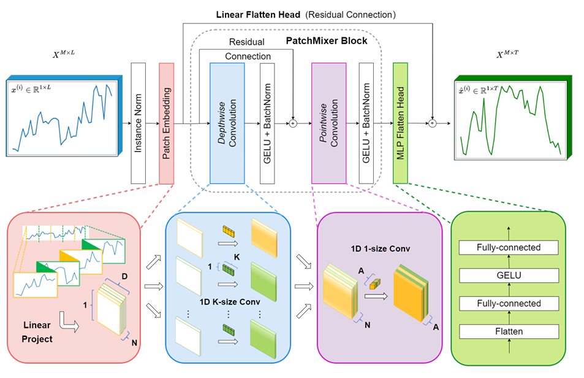

# PatchMixer: A Patch-Mixing Architecture for Long-Term Time Series Forecasting

> 기반 논문: **PatchMixer: A Patch-Mixing Architecture for Long-Term Time Series Forecasting (Gong et al., HKUST, 2024)**  
> 본 문서는 PatchMixer 논문 내용을 요약하고,  
> 현재 사용자가 구축한 **PatchMixer 기반 수요예측 모델 구조(BaseModel / QuantileModel)** 와의 연계까지 설명합니다.

---

## 1. 연구 배경 및 문제의식

**Long-Term Time Series Forecasting (LTSF)** 은 긴 시계열 구간의 미래값을 예측하는 문제로,  
전통적으로 Transformer 기반 모델(PatchTST, FEDformer 등)이 높은 성능을 보였으나,  
그 **핵심 성능 요인이 Transformer 구조인지, “패치 단위 표현(패치화)” 때문인지**는 명확하지 않았습니다.

> **연구 질문:**  
> “Patch-based Transformer의 성능은 Attention 구조 때문인가,  
> 아니면 Patch 단위의 데이터 전처리 방식 때문인가?”

이를 검증하기 위해 **PatchMixer**는 Attention이 아닌 **Convolution 기반 패치 처리 구조**로  
PatchTST 수준의 성능을 재현하며, **패치 단위 표현이 LTSF의 핵심임**을 보여줍니다.

---

## 2. 핵심 아이디어: Patch-Mixing Design

PatchMixer는 시간축을 **Patch 단위**로 분할하여 입력 시계열의 **로컬 패턴**을 학습하고,  
Depthwise Separable Convolution(DWConv)을 통해 **패치 간의 상호의존성**을 효율적으로 혼합(mixing)합니다.


### Channel Dependency vs. Patch Dependency
- **Channel Mixing (변수 간 혼합)** : 다변량 변수 간 상관관계 학습  
- **Patch Mixing (시간 패치 간 혼합)** : 단일 변수 내 시간 패턴 학습  
→ 실험적으로 **intra-variable dependency(패치 간)**가 더 강함을 확인 → Patch 중심 설계

### Patch Embedding
각 시계열 $$x^{(i)} \in \mathbb{R}^{L}$$ 을 패치 단위로 분리:

$$
x^{(i)}_p = [x^{(i)}_{1:P}, x^{(i)}_{1+S:P+S}, \dots, x^{(i)}_{L-P+1:L}]
$$

- P: patch length  
- S: stride  
- N = $$ \lfloor \frac{L-P}{S} \rfloor + 1 $$: patch 개수  
- 마지막 구간은 **Replicate Padding**을 통해 정보 손실 방지

---

## 3. PatchMixer 아키텍처 개요

### (1) 입력 구조
| 단계 | 텐서 형상 | 설명 |
|------|------------|------|
| 입력 | (B, L, N) | 배치, 시계열 길이, 변수 개수 |
| 정규화 | RevIN / InstanceNorm | 분포 이동 완화 |
| 패치 분할 | (B, N, patch_num, patch_size) | 슬라이딩 윈도우 패치화 |
| 선형 투영 | (B, N, patch_num, d_model) | patch_size → d_model |
| Flatten | (B×N, patch_num, d_model) | 변수별 독립처리 |

---

### (2) PatchMixer Block

PatchMixer의 핵심은 **Depthwise + Pointwise Conv**로 구성된 “패치 혼합 블록”입니다.

```python
x = x + DepthwiseConv1d(x)     # 패치 내부 로컬 패턴 (Residual)
x = PointwiseConv1d(x)         # 패치 간 상호작용
x = GELU + BatchNorm + Dropout
```

•	Depthwise Conv  
•	각 채널 독립적 처리로 연산량 감소 (MobileNet/Xception 스타일)  
•	커널 크기 K=8 기준, 지역적 시계열 패턴 포착  
•	Pointwise Conv (1×1)  
•	패치 간 global 관계 학습 (Channel Mixing 효과)  
•	Residual 연결로 안정적 학습 유지
---

### (3) Dual Forecasting Heads

PatchMixer는 Dual Head 구조를 도입해 선형/비선형 패턴을 동시에 학습합니다.

| Head        | 구조                       | 역할                       |
|-------------|--------------------------|--------------------------|
| Linear Head | 단일 Linear                | 장기적 추세(Trend)            |
| MLP Head    | Linear -> GELU -> Linear | 비선형 요동 (Irregularity)    |
| Output      | 두 Head를 합산               | Fine-to-Coarse 시계열 표현 강화 |


---

### (4) Instance Normalization (RevIN)

입력 시계열을 변수 단위로 정규화 후,
예측값 계산 뒤 원래의 평균/표준편차로 되돌리는 구조입니다.

$$
\text{norm}(x) = \frac{x - \mu}{\sigma}, \quad
\text{denorm}(\hat{y}) = \hat{y} \cdot \sigma + \mu
$$

이로써 분포 이동(domain shift) 에 강한 예측 성능 확보.

---

## 4. 논문 실험 결과

| Model                 | Architecture | Speed     | 성능 (MSE 기준) |
|-----------------------|--------------|-----------|--------------------------|
| Transformer(PatchTST) | Attention 기반 | 느림        | 기준 |
| MLP (DLinear)         | 단순 선형        | 빠름        |↓ |
| CNN (PatchMixer)      | DWConv 기반    | 2 ~ 3배 빠름 | ↑ +11.6~21.2% 향상 |

•	MSE/MAE 기준 SOTA 달성  
•	추론 속도 3배, 학습 속도 2배 향상  
•	Attention이 없어도 패치 표현만으로 Transformer 성능 재현

---

## 5. 현재 구현: PatchMixer 구조

### 사용자 커스터마이징 핵심
| 구성                   | 설명                                                  |
|----------------------|-----------------------------------------------------|
| Backbone             | PatchMixerBackbone (RevIN 포함, patch 기반 feature 추출)  |
| Head (BaseModel)     | Linear MLP로 구성된 Point Forecast Head (H-step 예측)     |
| Head (QuantileModel) | Decomposition Quantile Head - (q10, q50, q90) 예측    |
| Feature Branch       | 추가적인 Static/Exogeneous 피처 결합 (FeatureModel)         |
| Loss 함수              | BaseModel -> MSE/MAE, QuantileModel -> Pinball Loss |
| Exogenous Head       | 미래 외생 변수 (온도, 수요 변화율 등 ) 보정용 Linear Head            |


---

### BaseModel 구조
```python
x → PatchMixerBackbone → (B, a*d_model)
   → Linear(128) + Softplus + Dropout
   → Linear(64) + ReLU → Linear(H)
   → Output: (B, H)
```

•	단일 포인트 예측  
•	MSE 또는 MAE 기반 회귀 Loss 사용  
•	외생변수 입력 시 _apply_exo_shift_linear()로 Horizon 보정 수행

---
### QuantileModel 구조
```python
x → MultiScalePatchMixerBackbone(fused_dim=256)
   → DecompQuantileHead(in_dim=256, horizon=H, quantiles=(0.1,0.5,0.9))
   → Output: (B, 3, H)
```

•	다중 스케일 패치 조합으로 장·단기 패턴 동시에 반영  
•	Trend / Seasonal / Irregular decomposition 기반 Quantile 예측  
•	Pinball Loss를 통해 신뢰구간(80%) 기반 불확실성 추정 가능


