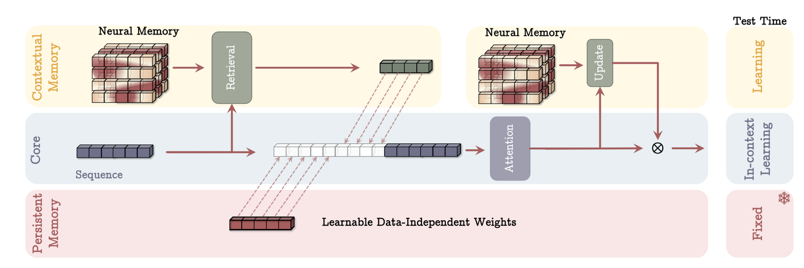

# Titan

## 1) 핵심 아이디어

- **MAC (Memory-as-Context)**  
  입력 시퀀스의 Attention K/V에 **컨텍스트 메모리(contextual)**와 **영구 메모리(persistent)**를 함께 넣어 과거 패턴을 직접 조회합니다. 짧은 `lookback`·긴 `horizon` 상황에서도 패턴 복원과 외삽이 안정적입니다.

- **가역 정규화(RevIN)**  
  파트/기간별 분포 변동을 줄이기 위해 입력을 **Reversible Instance Normalization**으로 표준화하고, 출력에서 **역정규화**로 원 스케일을 복원합니다.

- **로컬 패턴 재사용(LMM)**  
  인코더 은닉표현과 메모리 간 **유사도 Top-K 매칭**으로 과거의 유사 패턴을 끌어와 현재 토큰을 보강합니다. 장기 구간의 드리프트 및 폭주를 완화합니다.

- **추세/시즌 보정(TrendCorrector)**  
  인코더(또는 LMM 보강) 출력 위에 **추세/시즌 보정 헤드**를 더해 장기 외삽 안정성을 높입니다.

- **Seq2Seq 디코더(옵션)**  
  미래 H개의 **쿼리 토큰**이 **masked self-attention**과 **cross-attention(과거 메모리 참조)**으로 한 번에 H-step을 생성합니다. IMS(autoreg) 의존을 줄이고 **DMS 한 방**으로 롱호라이즌 품질을 확보합니다.

- **Test-Time Adaptation(TTA)**  
  추론 시 **컨텍스트 메모리 주입**과 **소규모 경사 업데이트**로 분포 시프트에 적응합니다.


---

## 2) Titan 아키텍처 개요

**전처리 → 인코딩(메모리 결합) → 보강(LMM) → 디코딩/헤드 → 보정(Trend) → 역정규화**
```python
x : [B, L, C]
└─ RevIN(norm) ────────────────────────────────────┐
│
MemoryEncoder (Backbone)           │
┌──────────────────────────────────────────────┴─────────────────────────┐
│ input_proj → [B, L, D] → (×n_layers) { MemoryAttention + FFN(Pre-LN) }│
│   ↑ K/V: concat([contextual_mem, persistent_mem, x_t]) along time     │
└────────────────────────────────────────────────────────────────────────┘
enc : [B, L, D]
┌───────────────┴───────────────┐
(옵션)LMM │                               │ (옵션) Seq2Seq
▼                               ▼
LMM(encoded, memory)            TitanDecoder(enc, future_exo?)
→ enhanced : [B, L, D]          → dec : [B, H, D]
│                               │
└─────── output head ───────────┘  → ŷ_core : [B, H]
+ TrendCorrector(enc) : [B, H]
= ŷ : [B, H]
└─ RevIN(denorm)
```

- **DMS(Base/LMM)**: 마지막 토큰(또는 보강 토큰) → 선형 헤드 → H-step  
- **DMS(Seq2Seq)**: 디코더가 H-step을 한 번에 생성  
- **IMS/하이브리드(운영 래퍼)**: 1-step 롤링 + 안정화 가드(윈저라이즈, 감쇠, 성장률 캡)  
- **TTA**: `add_context`(메모리 주입) / `adapt`(미세 업데이트)


---

## 3) 현재 구현: Titan 구조

> 첨부 스크립트(`configs.py`, `backbone.py`, `memory.py`, `decoder.py`, `Titans.py`)를 기준으로 구성 요소와 데이터 흐름을 요약합니다.

### (1) 설정 — `configs.py`

- `TitanConfig` 계열  
  - 공통 하이퍼파라미터: `batch_size, lookback, horizon(output_horizon), input_dim, d_model, n_layers, n_heads, d_ff`  
  - MAC: `contextual_mem_size, persistent_mem_size`  
  - 디코더 옵션: `n_dec_layers, dec_dropout, exo_dim(미래 외생변수 차원)`  
  - `output_horizon` 속성은 내부적으로 `horizon`과 동치로 사용

### (2) 인코더/백본 — `backbone.py`

- `MemoryEncoder`  
  - `input_proj: Linear(input_dim → d_model)`  
  - `layers: ModuleList[TitanBackbone] × n_layers`  
  - `forward(x[B,L,C]) → enc[B,L,D]`  
    - 각 레이어에서 **MemoryAttention**이 **contextual/persistent memory**와 입력을 time 차원으로 concat하여 K/V로 사용  
    - FFN(Pre-LayerNorm, Dropout 포함)으로 안정화

- `TitanBackbone`  
  - `MemoryAttention` + `PositionWiseFFN`의 Residual-PreLN 블록

### (3) 메모리/보조 — `memory.py`

- `LMM(d_model, top_k=5)`  
  - `forward(encoded[B,L,D], memory[B,M,D or M,D]) → [B,L,D]`  
  - 인코더 은닉과 메모리의 유사도를 구해 **Top-K 메모리**를 선택·평균해 토큰을 보강(로컬 패턴 재사용)

- `PositionWiseFFN(d_model, d_ff)`  
  - FFN 서브블록(활성화/드롭아웃/선형)

- (주의) `MemoryAttention`은 Backbone 내에서 import되어 사용되며, **K/V 확장**(contextual/persistent/입력 concat)이 핵심

### (4) 디코더(옵션) — `decoder.py`

- `TitanDecoderLayer(d_model, n_heads, d_ff, dropout, causal=True)`  
  - **masked self-attention**(미래 차단) → **cross-attention(enc)** → **FFN**, 단계별 Pre-LN & Residual

- `TitanDecoder(d_model, n_layers, n_heads, d_ff, dropout, horizon, exo_dim, causal)`  
  - 학습 가능한 `query_embed(1,H,D)` + `pos_embed(1,H,D)`  
  - (옵션) `exo_proj(exo_dim→D)`로 **미래 외생변수**를 쿼리에 주입  
  - `forward(memory[B,L,D], future_exo[B,H,exo_dim]|None) → dec[B,H,D]`

### (5) 모델 — `Titans.py`

- 공통 구성요소  
  - **RevIN**: `RevIN(num_features=input_dim, affine=True, subtract_last=True)`  
  - **TrendCorrector**: `TrendCorrector(d_model, output_horizon=horizon)`

- **Base `Model(config)`**  
  - `x → RevIN(norm) → MemoryEncoder → output_proj(Linear D→H) → RevIN(denorm) → ŷ[B,H]`  
  - 단순 DMS 헤드

- **`LMMModel(config)`**  
  - `x → RevIN → MemoryEncoder → LMM 보강 → output_proj(Linear D→H [+Softplus])`  
  - `+ TrendCorrector(enc or enhanced)` 합산 → `RevIN(denorm)`  
  - 학습/추론에서 LMM/메모리 핸들링 분기(`mode='train'|'eval'` 지원)

- **`FeatureModel(config, feature_dim)`**  
  - `MemoryEncoder(x)` + `Linear(feature_dim→D)`로 부가 피처를 동일 차원으로 투영, 마지막 시점과 합성 후 `output_proj(D→H)`

- **`LMMSeq2Seq(config)`** *(Seq2Seq 디코더 버전)*  
  - `x → RevIN → MemoryEncoder(enc)`  
  - `dec = TitanDecoder(enc, future_exo?) → output_proj(time-distributed Linear D→1)`  
  - `ŷ_core[B,H] + TrendCorrector(enc)[B,H] → RevIN(denorm)`  
  - IMS 없이 **안정적 DMS**. `future_exo[B,H,exo_dim]`로 휴일/프로모 등 미래 변수 반영 가능

- **`TestTimeMemoryManager(model, lr)`**  
  - `add_context(new_context)` — 인코더 각 블록의 **contextual memory 업데이트**  
  - `adapt(x_new, y_new, steps)` — **소규모 경사 업데이트**(MSE)로 분포 시프트에 적응

### (6) 형상 요약

- 입력: `x ∈ ℝ^{B×L×C}`  
- 인코더 출력: `enc ∈ ℝ^{B×L×D}`  
- 디코더 출력(옵션): `dec ∈ ℝ^{B×H×D}`  
- 최종 예측: `ŷ ∈ ℝ^{B×H}` (RevIN 역정규화 후)

### (7) 학습/추론 노트

- **Loss**: 기본 `MSE`, 필요 시 **Pinball/Huber + 간헐(Intermittent)·호라이즌 감쇠 가중** 적용 가능  
- **예측 모드**:  
  - DMS(Base/LMM/Seq2Seq) 우선, 필요 시 IMS/하이브리드(운영 래퍼) 사용  
  - IMS 사용 시 안정화 가드(윈저라이즈, `dampen`, 성장률 cap) 권장  
- **TTA**: 검증/운영에서 `add_context`만으로도 효과, 라벨이 있을 땐 `adapt(steps)` 추가

---
